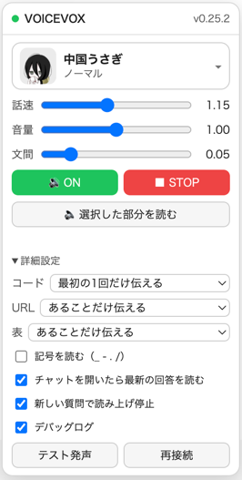
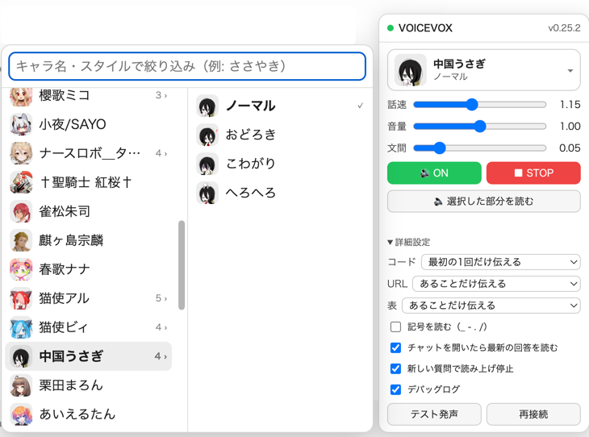

# ChatGPT → VOICEVOX Bridge

ChatGPT Web 版の回答を、**生成の途中から VOICEVOX の好きなキャラクターの声で**自動的に読み上げる、Chrome 用の UserScript（Tampermonkey）です。

> **非公式ツールです。** OpenAI・VOICEVOX とは関係ありません。

## できること



ChatGPT を開くと、画面の右下にこのパネルが出ます。


- **回答が出始めた瞬間から読み上げ**：全文がそろうのを待たず、書かれた順に読んでいきます
- **キャラクターとスタイルを顔アイコンで選べる**：「ささやき」などで絞り込みも可能
- **コード・表・URL は読み方を選べる**：「ここにコードがあります」と伝えるだけにする、など
- **過去の回答を読み直せる**：各回答の右上の「🔊 この回答を読む」から
- **選んだ部分だけ読む**：ページ上でドラッグした範囲を読み上げ
- **OpenAI API 不要・会話を外部に送らない**：通信するのは ChatGPT 自身と、手元の VOICEVOX だけ

<br clear="right">

```
声 → Aqua Voice など → ChatGPT Web → この UserScript → VOICEVOX（手元の Mac）→ スピーカー
```

## 動作環境

| 必要なもの | 内容 |
| --- | --- |
| Mac | macOS（Windows でも動く可能性はありますが未確認） |
| ブラウザ | Chrome 系ブラウザ |
| 拡張機能 | [Tampermonkey](https://www.tampermonkey.net/) |
| 音声エンジン | [VOICEVOX](https://voicevox.hiroshiba.jp/)（アプリ、または VOICEVOX Engine 単体） |
| ChatGPT | ChatGPT Web（Plus などのアカウント） |

## 導入手順

1. **VOICEVOX を起動する**（`http://127.0.0.1:50021` で待ち受けが始まります）
2. **Chrome に [Tampermonkey](https://www.tampermonkey.net/) を入れる**
3. `chrome://extensions` で Tampermonkey の「詳細」を開き、**「ユーザー スクリプトを許可する」を ON** にする
4. **次の URL を Chrome で開く** → Tampermonkey のインストール画面が出るので「インストール」

   ```
   https://raw.githubusercontent.com/mizumori-24522/chatgpt-voicevox-bridge/main/dist/chatgpt-voicevox.user.js
   ```

5. **https://chatgpt.com を開く**
6. 右下に **● VOICEVOX パネル**が出ます。緑の ● と `v0.xx.x` が出れば接続成功です
7. 話者を選び、「詳細設定 → テスト発声」で音が出ることを確認
8. あとは普段どおり ChatGPT に質問するだけ。回答の生成途中から読み上げが始まります

### 毎回の起動順

1. VOICEVOX を起動
2. ブラウザを起動して ChatGPT を開く
3. パネルの ● が緑（接続中）になっていることを確認
4. Aqua Voice などで質問する

### 更新

新しい版が出ると **Tampermonkey が自動で取り込みます**（既定で 1 日 1 回確認）。
すぐに欲しいときは、Tampermonkey のダッシュボードで「ユーティリティ」→「インストール済みスクリプトの更新を確認」。

## 使い方

### キャラクターの選び方

パネル上部の話者をクリックすると、「キャラクター → スタイル」の2段メニューが開きます。
左のキャラクターにマウスを乗せると、右にスタイル（ノーマル・おどろき など）が出ます。上の欄に「ささやき」のように入力すると絞り込めます。



### パネルの操作

| 項目 | 内容 |
| --- | --- |
| ● | VOICEVOX との接続状態。緑=接続中 / 黄=接続試行中 / 灰=未接続（クリックでパネルを開閉） |
| 話者（顔アイコン付き） | キャラクターとスタイルを選ぶ（上の「キャラクターの選び方」参照） |
| 話速 / 音量 | 読み上げの速さと大きさ（話速の初期値は 1.15） |
| 文間 | 文と文の間の無音の長さ。箇条書きの切り替わりの速さに効きます |
| 🔊 ON / 🔇 OFF | 読み上げの有効・無効 |
| ■ STOP | 読み上げを即座に止める（待っている分もすべて破棄） |
| 🔈 選択した部分を読む | ページ上でドラッグ選択した範囲だけを読む |
| コード | 読まない / 最初の1回だけ伝える（既定）/ 毎回伝える / 読む |
| URL / 表 | 読まない / あることだけ伝える / 読む |
| 記号を読む（_ - . /） | ファイル名やパスの中の記号を読む（既定 OFF） |
| チャットを開いたら最新の回答を読む | 既定 ON。チャットを開いて表示が落ち着いたら、最新の回答を頭から読む |
| 新しい質問で読み上げ停止 | 既定 ON |
| デバッグログ | 不具合の調査用。ブラウザの Console にログを出す |
| テスト発声 / 再接続 | 動作確認用 |

### 過去の回答を読み直す

各回答にマウスを乗せると、右上に **「🔊 この回答を読む」** が出ます。

### 単語の読み方を直したいとき

VOICEVOX 本体の **「読み方＆アクセント辞書」** がそのまま効きます。
`NVIDIA → エヌビディア` のように登録すれば、次の読み上げから反映されます（この UserScript 側の設定は不要）。

このツール側で扱うのは記号だけ（`ChatGPT_PLAN.md` の `_` や `.` など）で、パネルの「記号を読む」で切り替えます。
英数字に挟まれた記号だけが対象なので、普通の文中のハイフンや `2026/09/18` のような日付は巻き込みません。

## トラブルシューティング

| 症状 | 対処 |
| --- | --- |
| ● が灰色（未接続） | VOICEVOX を起動してから「再接続」 |
| 「再生がブロックされました」 | ページを一度クリックしてから再度質問する（ブラウザの自動再生制限のため） |
| 読み上げが始まらない | パネルが 🔊 ON か確認。詳細設定の「デバッグログ」を ON にして Console を見る |
| 途中から二重に読む | Console の `[Observer]` ログを添えて報告してください |
| パネルが出ない | Tampermonkey でスクリプトが有効か、`@match` が今の URL と一致するか確認 |

## プライバシー

会話内容を外部へ送信しません。通信先は次の2つだけです。

```
ChatGPT Web 自身
127.0.0.1:50021（手元の VOICEVOX Engine）
```

- analytics / telemetry なし
- 外部へのログ送信なし
- API キーの保存なし
- 読み上げたテキストの永続保存なし

設定はブラウザの `localStorage`（キー `cvb.settings.v2`）に保存されます。`v1` の保存内容があれば自動で移行します。

## 仕組み（開発者向け）

| モジュール | 役割 |
| --- | --- |
| `chatgpt-adapter.ts` | ChatGPT の DOM 依存を全部ここへ隔離。UI 変更時はここだけ直す |
| `observer.ts` | MutationObserver + 200ms ポーリング。mutation を直接 TTS へ流さない |
| `text-diff.ts` | 「消費済み文字数」を持ち、再描画されても同じ文章を二度読まない |
| `chunker.ts` | `。！？` 改行を境界に、35〜180 文字の自然な単位へ切り出す |
| `speech-sanitizer.ts` | DOM 構造を根拠にコード・表・URL・引用番号を処理 |
| `voicevox-client.ts` | `/version` `/speakers` `/audio_query` `/synthesis` |
| `playback-queue.ts` | 合成ループと再生ループを分離。喋りながら次を先読み合成する |
| `ui.ts` | Shadow DOM のフローティングパネル（ChatGPT の CSS と干渉しない） |
| `voice-picker.ts` | キャラクター → スタイルの2段メニュー |
| `icon-cache.ts` | 顔アイコンを必要な分だけ取り、同じものは二度取らない |
| `message-actions.ts` | 各回答へ「この回答を読む」ボタンを差し込む |

Markdown をテキストとしてパースするのではなく、ChatGPT が既にレンダリングした DOM（`<pre>` `<table>` `<a>` など）を見て判定しています。生成途中の未閉じコードフェンスに強いのが理由です。

<details>
<summary>読み上げの細かい挙動</summary>

- 文と文の間に無音を作らないため、**再生中に次のチャンクを先読み合成**する（既定2つ先まで）。再生そのものは常に1本だけで、音声は重ならない。
- VOICEVOX は既定で 1 チャンクの前後に 0.1 秒ずつ無音を付ける。箇条書きのように短い項目が連続すると、これが項目ごとの間として積み上がる。既定を `prePhonemeLength=0.0` / `postPhonemeLength=0.05` / `pauseLengthScale=0.9` に下げてある（実測で 1 チャンクあたり約 0.13 秒短縮）。パネルの「文間」は `postPhonemeLength`、話速 / 音量は `audio_query` の `speedScale` / `volumeScale`。
- コードブロックは、罫線で描いた図（`┌─┐│└┘` などが3割以上）なら「ここに図があります」、そうでなければ「ここにコードがあります」と言い分ける。
- 既定では**1つの回答につき最初の1回しか知らせない**。図やコードが何度も出てくる回答で同じ台詞を繰り返さないため。毎回知らせたいなら設定で変えられる。
- 絵文字は読み上げ前に除去する。VOICEVOX へ渡すと不自然な間が入るため。
- 生成中判定は停止ボタンに**依存しきらない**。本文の増加が 1.2 秒止まったら生成完了とみなして残りを吐き出すため、ChatGPT がボタンの命名を変えても読み上げが尻切れにならない。
- **ページを開き直しただけの回答は読み上げない。** 会話が仮想化されているため、リロードや別の会話への移動でも質問と回答が「後から DOM に現れる」。出現だけでは新規と区別できないので、読み上げを解禁するのは次のときだけにしている。
  1. 入力欄での送信操作（Enter / 送信ボタン。日本語変換確定の Enter は除く）
  2. **同じ会話の中で**質問が増えた（URL が変わったら基準を捨てる）
  3. 生成中を観測した

  解禁は回答1つを読み始めたら使い切る。

</details>

<details>
<summary>実測した ChatGPT の DOM（2026-09-26）</summary>

2026-09 下旬に構造が丸ごと変わり、旧来の `data-turn` / `data-message-author-role` が消えた。

```html
<div data-content-search-turn-key="fallback-turn-0">   ← 後で UUID に差し替わる
  <div data-content-search-unit-key="fallback-turn-0:0:user">…質問…</div>
  <div data-content-search-unit-key="fallback-turn-0:2:assistant"
       data-chatgpt-search-message-ids="<回答ID>">
    <div data-markdown-text-style="assistant-message">  ← 本文
```

- 回答の同一性は `data-chatgpt-search-message-ids`（ターンの鍵は途中で変わるので使わない）
- 質問にはメッセージ ID が無いので、本文で同一性を見る
- 入力欄は `[data-composer-body] [contenteditable]`、送信ボタンは `aria-label="送信"`
- アダプタは旧構造にもフォールバックする

</details>

<details>
<summary>実測した ChatGPT の DOM（2026-09-15 / GPT-6 世代 UI）</summary>

```html
<section data-turn="assistant" data-turn-id="<uuid>"
         data-testid="conversation-turn-10">
  <div data-message-author-role="assistant" data-message-id="<uuid>">
    <div class="... markdown prose ...">  ← 本文
```

- 会話は**仮想化**されており、画面外のターンでは内側の `[data-message-author-role]` が DOM から消える。外側の `section[data-turn]` は残るので、そちらを一次の拠り所にしている。
- メッセージ同一性は `data-turn-id`（UUID）→ `data-message-id` の順で採用。
- Web検索の出典は `[data-testid="webpage-citation-pill"]` なので読み上げから除外。

</details>

<details>
<summary>キャラクター画像の取得</summary>

顔アイコンは VOICEVOX Engine の `/speaker_info` から取る。既定のままだとサンプル音声まで base64 で同梱されて 1 キャラ 5MB を超えるので、`resource_format=url` で URL だけ受け取り、画像は表示するものだけ個別に取りに行く。

chatgpt.com のページから `http://127.0.0.1` の画像を `` で直接読むことはできない（Private Network Access で止まる）。`GM_xmlhttpRequest` でバイト列を取り、`blob:` URL に変換して表示している。

</details>

<details>
<summary>CORS について</summary>

`https://chatgpt.com` から `http://127.0.0.1:50021` への直接 `fetch` は CORS / Private Network Access で弾かれることがあります。そのため通信は **Tampermonkey の `GM_xmlhttpRequest`** 経由で行います。権限は最小限に絞っています。

```
@connect 127.0.0.1
@connect localhost
```

`@connect *` は使っていません。

</details>

## 開発

```bash
npm install
npm test        # 単体テスト (vitest)
npm run typecheck
npm run build
```

### 新しい版を配布する

Tampermonkey は `@version` が上がったときだけ更新を取り込みます。
**版を上げずに push しても、利用者には届きません。**

```bash
npm run release        # 0.2.0 → 0.3.0（機能追加）
npm run release:patch  # 0.2.0 → 0.2.1（修正のみ）
```

テスト → 版上げ → ビルドまで行うので、あとは `dist/` ごとコミットして push します。

**編集しているのは `src/` の TypeScript であって、Tampermonkey の中のコードではありません。**
`npm run build` で `dist/chatgpt-voicevox.user.js` を作り直し、それを Tampermonkey へ入れ直して初めて反映されます。

<details>
<summary>毎回入れ直したくない場合</summary>

Tampermonkey のスクリプトを殻だけにして、手元のビルド成果物を直接読ませます。
（このファイルは各自の Mac のパスを含むので、リポジトリには入れていません）

```js
// ==UserScript==
// @name         ChatGPT → VOICEVOX Bridge (dev)
// @match        https://chatgpt.com/*
// @connect      127.0.0.1
// @connect      localhost
// @grant        GM_xmlhttpRequest
// @require      file:///Users/<ユーザー名>/chatgpt-voicevox-bridge/dist/chatgpt-voicevox.user.js
// ==/UserScript==
```

`chrome://extensions` の Tampermonkey で **「ファイルの URL へのアクセスを許可する」を ON** にすること。
以後は `npm run build` してページをリロードするだけで反映されます。

</details>

## 非目標（Ver.1）

OpenAI API 利用 / ChatGPT Voice Mode 統合 / Aqua Voice 制御 / スマホ対応 / MCP。
詳細は [PLAN.md](PLAN.md) を参照。

## クレジット

- 音声合成：[VOICEVOX](https://voicevox.hiroshiba.jp/)
- 画像に写っているキャラクター（VOICEVOX:中国うさぎ ほか）の画像・音声の権利は、それぞれの権利者に帰属します。読み上げた音声を公開・配布するときは、各キャラクターの利用規約に従ってクレジットを表記してください。
